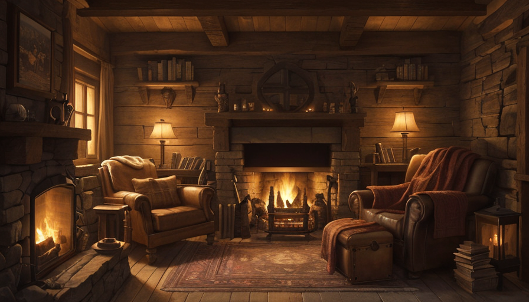
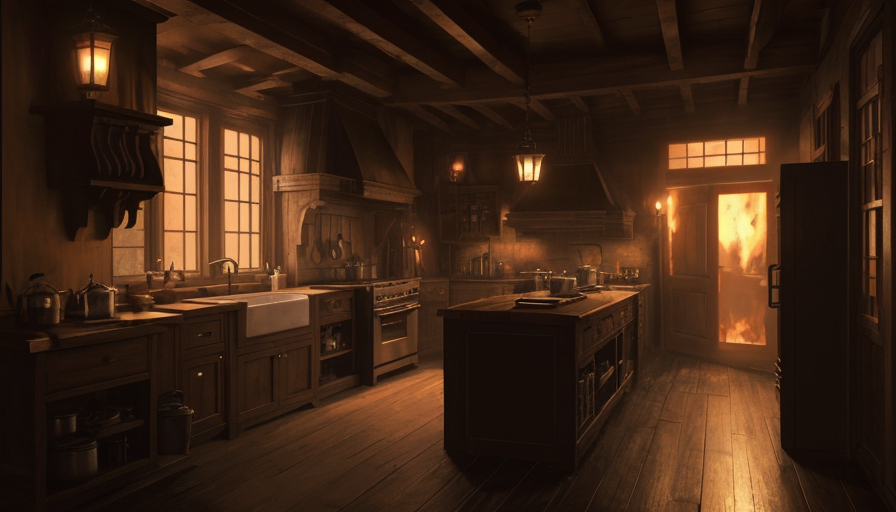
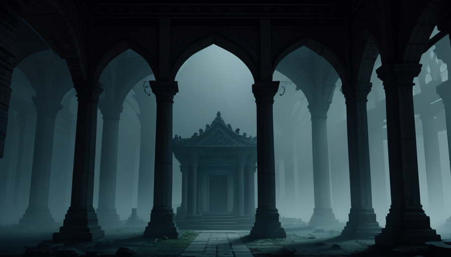

# Grimoire

**Your own AI Dungeon Master. On your PC. Free forever.**

Grimoire is a Dungeons & Dragons-style adventure game you host yourself. An AI storyteller
narrates with a real voice, paints the scenes as you explore, asks for dice rolls, and never
tells the same story twice. Play alone, or have up to six friends join from their browsers.

No accounts. No cloud. No subscription. Everything runs on the host's machine.



## How it plays

You type what you do — *"I sneak up to the warehouse window"* — and within a second the
storyteller answers, out loud. Real attempts call for real dice: a d20 roll against a fair DC,
resolved by an actual rules engine (the AI never fudges math). Success and failure both push
the story somewhere new. Scene art fades in behind the story while you play; music follows
the mood; everything is saved continuously, so next weekend picks up mid-sentence.

| | |
|---|---|
|  |  |

Every hero gets a painted portrait, generated from your own description:


## Start playing (host)

**Windows** — install nothing first, just:

```powershell
git clone https://github.com/T0M13/grimoire.git
cd grimoire
.\start.ps1
```

**Linux:**

```bash
git clone https://github.com/T0M13/grimoire.git
cd grimoire && chmod +x setup.sh start.sh stop.sh
./start.sh
```

The first start installs everything itself (Node, Python, Ollama, the AI models — about 10 GB,
one time) and **checks what your PC can handle**: a decent NVIDIA GPU gets the full experience,
a weak GPU or none at all gets a smaller, faster model that still plays great. Then it opens
at **http://localhost:5173**. Create your hero and begin.

Stopping is automatic — close the last browser tab and the whole stack shuts itself down.

## Friends join in 10 seconds

They don't install anything. You (the host) tell them your address:

- **Same WiFi:** they open `http://YOUR-PC-IP:5173` (find yours with `ipconfig` / `ip a`)
- **Not in the house:** easiest is [Tailscale](https://tailscale.com) on both machines, then
  the same URL with your Tailscale IP. (Don't port-forward Grimoire to the open internet —
  it has no login. Details in [docs/10-hosting.md](docs/10-hosting.md).)

They pick a hero, step into the tale, and share your campaign — everyone hears the same
storyteller and sees the same scenes.

## Let a bot try it

Grimoire has an open API (one WebSocket — the same one the browser uses). A built-in bot can
join and play by itself, which is also the quickest health check of a host:

```bash
npm run demo        # a bot plays for 2 minutes and prints the story + dice
```

See [docs/09-api.md](docs/09-api.md) to build your own client or let another AI play.

## What's inside

- AI Dungeon Master (local LLM via Ollama) with a two-pass design: it *chooses a move*
  (structured, schema-constrained), then narrates — a deterministic 5e SRD rules engine does
  all dice and math
- Spoken narration (local Kokoro voice, male/female narrator) and per-NPC voices
- Scene art and hero portraits generated locally (ComfyUI + Stable Diffusion)
- Full SRD level-1 character creator: 9 races, 12 classes, point-buy/array/rolled
- Quests journal, character sheets, procedural mood soundtrack, save slots
- Act / Speak / Ask-DM intent modes; everything persists in SQLite on the host

## Digging deeper

| | |
|---|---|
| [docs/10-hosting.md](docs/10-hosting.md) | Hosting, hardware tiers, Linux servers, security |
| [docs/09-api.md](docs/09-api.md) | The play-by-WebSocket API + autoplay bot |
| [docs/05-handoff.md](docs/05-handoff.md) | Exact implemented state — start here to contribute (human or AI) |
| [docs/01-game-design.md](docs/01-game-design.md) … [08](docs/08-progression-and-content.md) | Design, research, architecture, roadmap, SRD coverage, progression |

Rules content: 2014 SRD under CC-BY-4.0 — attribution in [NOTICE.md](NOTICE.md).
