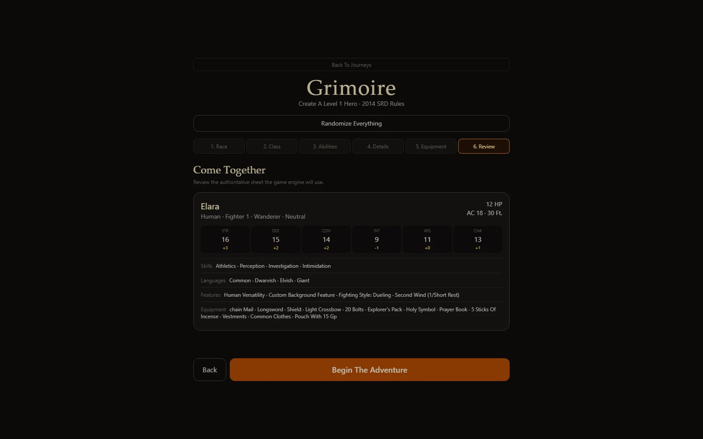
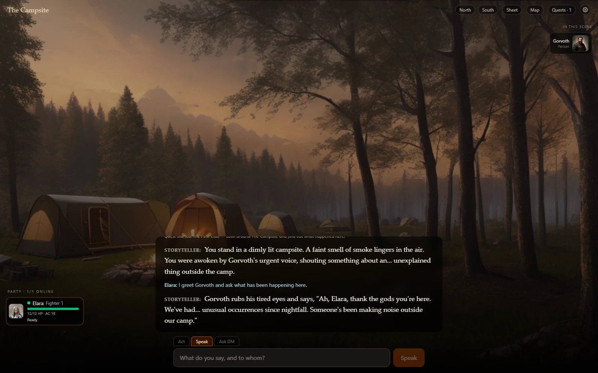
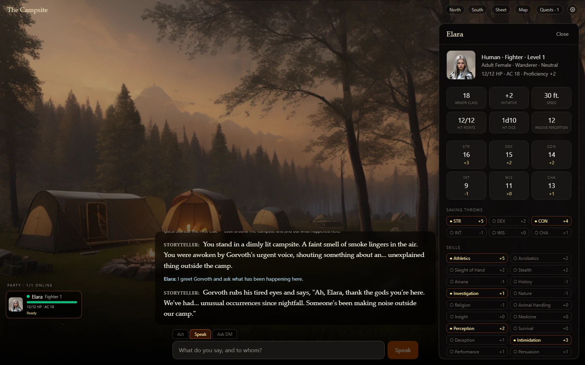

# Grimoire

Grimoire is a work-in-progress fantasy role-playing game that runs in a web browser. One person
hosts the game on a Windows or Linux computer, and friends join the same journey by opening a link.

Create a hero, explore new places, speak with characters, choose what to do, and make dice checks.
The game writes and speaks the story as you play, with changing scene art, portraits, music, and
sound effects.

> **Work in progress:** Grimoire is playable, but it is still being actively developed. Some systems
> are incomplete, features may change, and you may find rough edges. Anyone is welcome to try the
> current build and [report a problem](https://github.com/T0M13/grimoire/issues).

## See the current build

These screenshots come from a real five-minute play session in the current development build. The
places, characters, and story can be different in every journey.

### Create your hero

Build a complete level-1 character with guided tabs, or use **Randomize Everything** when you want
to begin quickly. The Review tab shows the final abilities, skills, languages, features, spells,
and equipment before the adventure starts.



### Explore and choose what happens

Write any action you can think of, or select one of the suggested choices. Use **Act** for actions,
**Speak** to address a character directly, and **Ask DM** when you want information about the world
or the rules.


### Speak with characters

Named people and creatures can have their own portrait and voice. Their relationship with each
hero can change as the story continues.



### Keep playing while checking your character

The character sheet, map, quests, and settings open beside the story. You can still type and
continue the journey while a panel is open.



## What can you do today?

- Create a level-1 hero using races, classes, abilities, backgrounds, skills, languages, and
  equipment from the included 2014 SRD rules.
- Randomize a complete legal character.
- Type your own actions or use suggested choices.
- Explore generated locations with spoken narration, scene art, portraits, music, and sound effects.
- Speak directly to named characters and build friendships, rivalries, or relationships over time.
- Make character-based skill checks when an action has a meaningful risk.
- Follow quests and inspect the party, map, character sheets, inventory, and settings.
- Save journeys on the host computer and load them again later.
- Play alone or share one journey with friends.

The current rules implementation is not a complete tabletop ruleset. More combat, progression,
spells, items, quests, and open-world systems are still being built.

## Start on Windows

The first start installs the required tools and downloads the game models. This may take a while,
uses several gigabytes of data, and needs at least 15 GB of free disk space; 20 GB leaves room for
new models and generated images.

Automatic installation is tested on Windows 11 with `winget`, which is normally included. If
`winget` is missing, install **App Installer** from Microsoft first and then run the start script
again.

### Download without Git

1. [Download the current Grimoire ZIP](https://github.com/T0M13/grimoire/archive/refs/heads/main.zip).
2. Extract the ZIP into a normal folder.
3. Open that folder, click the File Explorer address bar, type `powershell`, and press Enter.
4. Run:

```powershell
.\start.ps1
```

Follow any Windows installation or firewall prompts. When startup finishes, open
[http://localhost:8786](http://localhost:8786) in your browser.

If Windows blocks the script, run this instead:

```powershell
powershell -ExecutionPolicy Bypass -File .\start.ps1
```

### Clone with Git

If you already use Git:

```powershell
git clone https://github.com/T0M13/grimoire.git
cd grimoire
.\start.ps1
```

If `npm` is already available in your terminal, you can also use:

```powershell
npm start
npm stop
```

## Start on Linux

Grimoire supports current Debian/Ubuntu, Fedora, and Arch-family distributions. Install Git with
your distribution's software manager first, then run:

```bash
git clone https://github.com/T0M13/grimoire.git
cd grimoire
chmod +x setup.sh start.sh stop.sh
./start.sh
```

Open [http://localhost:8786](http://localhost:8786) when startup finishes. See the
[hosting guide](docs/10-hosting.md) for persistent server mode and systemd setup.

## Play with friends

Friends do not need to install the game. The host starts Grimoire, and everyone else opens the
host's address in a browser.

### On the same network

1. Start Grimoire on the host computer.
2. On Windows, run `ipconfig` and find the **IPv4 Address** under the active Wi-Fi or Ethernet
   connection. On Linux, run `ip a` and find the active connection's IPv4 address.
3. Friends open that address with port `8786`, for example `http://192.168.1.25:8786`.
4. They choose **Join Current Journey**, create a hero, and join the party.

The host may need to allow Node.js through the firewall on private networks.

### Across the internet

Use a private network such as [Tailscale](https://tailscale.com), or put Grimoire behind an
authenticated HTTPS proxy. Do not expose ports `8786` and `8787` directly to the internet. The
[hosting guide](docs/10-hosting.md) explains the options.

Grimoire does not yet have host permissions or its own sign-in screen. Anyone who can reach the
address can interact with the shared campaign, so protect any public address.

## How multiplayer works today

The current version has one shared journey on each host:

- Everyone sees the same location, story, quests, dialogue, images, and dice results.
- There is no fixed turn order during exploration. Anyone may act when the game is ready.
- The game resolves one player action at a time.
- Only the named hero can complete a pending dice check.
- Dialogue and narration are visible to the whole party.

Private conversations, separate locations, parallel activities, and personal side quests are
planned, but they are not part of the current build yet.

## Stop or keep the host running

A normal start shuts down the game services about 15 seconds after the final browser tab closes.
To stop immediately on Windows:

```powershell
.\stop.ps1
```

To keep a Windows host running after everyone closes their tabs:

```powershell
.\start.ps1 -Persistent
```

On Linux, use:

```bash
./stop.sh
./start.sh --persistent
```

## Hardware notes

A modern NVIDIA GPU gives the best narration and image-generation speed. Grimoire selects a
smaller model for weaker GPUs or CPU-only systems, but generation will be slower and some media
features may take longer or temporarily fall back to text.

## More information

| Guide | What it covers |
|---|---|
| [Hosting and multiplayer](docs/10-hosting.md) | Networks, servers, hardware, and security |
| [Current implementation](docs/05-handoff.md) | What is finished and what still needs testing |
| [Game design](docs/01-game-design.md) | The intended player experience |
| [WebSocket API](docs/09-api.md) | The autoplay tool and custom clients |
| [Ideas and planned work](docs/11-ideas-backlog.md) | Features being considered |

The included 2014 SRD rules content is used under CC BY 4.0. See [NOTICE.md](NOTICE.md).
